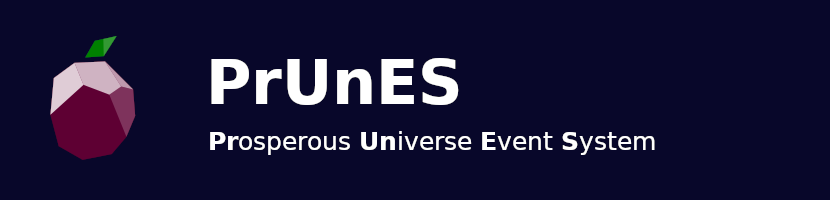

PrUnES collects data from [Prosperous Universe](https://prosperousuniverse.com/)
via the [FIO community API](https://fio.fnar.net/) and
creates [events](https://en.wikipedia.org/wiki/Event-driven_programming), which can be listened to and trigger
actions, like sending e-mail notifications or create task in an external to-do app.
This project is build with [Symfony](https://symfony.com).

> [!WARNING]
> This project is currently in development. Features might be added, removed or changed. 